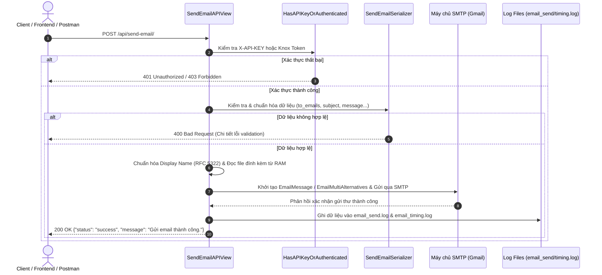

# SendMail API Module (Django REST Framework)

Ứng dụng REST API gửi Email hỗ trợ tệp đính kèm (Plain text & HTML), ghi nhật ký (logging) và đo đạc thời gian thực thi (timing performance).

## 📁 Cấu trúc thư mục

```
Artificial_Intelligence/Tools/SendMail/
├── __init__.py
├── apps.py
├── settings.py                         # Cấu hình Django & SMTP mặc định dành cho module SendMail
├── serializers.py                      # SendEmailSerializer kiểm tra & chuẩn hóa dữ liệu đầu vào
├── views.py                            # SendEmailAPIView xử lý gửi mail & LoginAPI đăng nhập lấy token Knox
├── urls.py                             # Định tuyến URL (/api/login/, /api/send-email/)
├── manage.py                           # Lệnh quản lý & khởi chạy Django Server độc lập
├── requirements.txt                    # Danh sách thư viện Python cần thiết
├── .env.example                        # Mẫu biến môi trường cài đặt SMTP Gmail/Hệ thống & API Key
├── .gitignore                          # Cấu hình loại bỏ file rác & file log
├── SendMail.postman_collection.json    # File cấu hình Postman mẫu để test 1-Click
└── README.md                           # Hướng dẫn tích hợp & sử dụng API
```

---

## 💻 Hướng dẫn Khởi chạy & Tích hợp (Setup & Run Guide)

### 1. Tạo & Kích hoạt Môi trường ảo Python (`.venv`)

Mở Terminal tại thư mục `Tools/SendMail` và khởi tạo venv cách ly:

- **Tạo môi trường ảo**:
  ```bash
  python -m venv .venv
  ```

- **Kích hoạt môi trường ảo**:
  - **Windows (PowerShell)**:
    ```powershell
    .\.venv\Scripts\Activate.ps1
    ```
    *(Nếu bị lỗi ExecutionPolicy trên PowerShell, hãy chạy lệnh: `Set-ExecutionPolicy Unrestricted -Scope Process`)*
  - **Windows (CMD / Command Prompt)**:
    ```cmd
    .\.venv\Scripts\activate.bat
    ```
  - **macOS / Linux**:
    ```bash
    source .venv/bin/activate
    ```

---

### 2. Cài đặt các thư viện phụ thuộc (Requirements)
Sau khi đã kích hoạt `.venv`, tiến hành cài đặt thư viện:
```bash
pip install -r requirements.txt
```
*(Bao gồm: `django`, `djangorestframework`, `django-rest-knox`, `python-dotenv`)*

---

### 3. Cấu hình biến môi trường (`.env`)
Tạo file `.env` từ file mẫu `.env.example`:
- **Windows (PowerShell)**: `Copy-Item .env.example .env`
- **Linux/macOS/CMD**: `cp .env.example .env`

Mở file `.env` và điền cấu hình máy chủ SMTP (Gmail App Password) cùng API Key của bạn:
```env
# Cấu hình SMTP Email
EMAIL_BACKEND=django.core.mail.backends.smtp.EmailBackend
EMAIL_HOST=smtp.gmail.com
EMAIL_PORT=587
EMAIL_USE_TLS=True

# Email gửi & Mật khẩu ứng dụng Gmail (App Password 16 ký tự)
EMAIL_HOST_USER=service.system@gmail.com
EMAIL_HOST_PASSWORD=xxxx xxxx xxxx xxxx
DEFAULT_FROM_EMAIL=service.system@gmail.com

# Tên hiển thị Alias mặc định
EMAIL_DISPLAY_NAME=System Email Notification Service

# API Key cho phương án Server-to-Server
SENDMAIL_API_KEY=sendmail-secret-api-key-2026
```

---

### 4. Khởi tạo Database & Tài khoản User (Nếu muốn dùng Knox Token)
Chạy lệnh migration để tạo các bảng dữ liệu cho Token Knox và User:
```bash
python manage.py migrate
```
Tạo tài khoản Administrator/User để lấy token login:
```bash
python manage.py createsuperuser
```

---

### 5. Lệnh Khởi chạy Server (Run Server)

#### Cách A: Chạy độc lập module SendMail
Chạy trực tiếp từ thư mục `Tools/SendMail`:
```bash
python manage.py runserver 8000
```

#### Cách B: Tích hợp vào Dự án Django có sẵn
1. Đăng ký App trong `settings.py` của dự án chính:
   ```python
   INSTALLED_APPS = [
       # ...
       'rest_framework',
       'knox',
       'Tools.SendMail',
   ]
   ```
2. Thêm tuyến đường URL vào `urls.py` chính:
   ```python
   from django.urls import path, include

   urlpatterns = [
       path('api/', include('Tools.SendMail.urls', namespace='sendmail')),
   ]
   ```
3. Chạy Server dự án chính:
   ```bash
   python manage.py runserver 8000
   ```

 Server sẽ lắng nghe tại: **`http://localhost:8000/api/send-email/`**

---

## ⚙️ Cách thức hoạt động của Module SendMail (Workflow)

Module SendMail hoạt động theo một quy trình xử lý khép kín, an toàn và tối ưu hiệu năng:



### Chi tiết các bước xử lý nội bộ:

1. **Tiếp nhận Request & Kiểm tra Quyền (Authentication)**:
   - Request gửi tới `POST /api/send-email/`.
   - Lớp `HasAPIKeyOrAuthenticated` kiểm tra Header `X-API-KEY` (dành cho kết nối Server-to-Server) hoặc Token Knox `Authorization: Token <token>` (dành cho người dùng).
2. **Kiểm tra & Chuẩn hóa Dữ liệu (Validation & Parsing)**:
   - `SendEmailSerializer` phân tích dữ liệu đầu vào.
   - Trường `to_emails` tự động chuẩn hóa từ JSON Array `["a@example.com"]`, chuỗi phân cách dấu phẩy `"a@example.com, b@example.com"`, hoặc Python list.
3. **Định dạng Display Name & Đọc Tệp đính kèm**:
   - Định dạng tên hiển thị người gửi chuẩn RFC 5322: `"Display Name Alias" <smtp_user@gmail.com>`.
   - Nếu request có đính kèm tệp (`FormData`), API đọc trực tiếp từ bộ nhớ RAM (`request.FILES`) mà không lưu file tạm xuống đĩa cứng, giúp bảo mật và tối ưu I/O.
4. **Gửi thư qua Máy chủ SMTP**:
   - Sử dụng `EmailMessage` (cho Plain text) hoặc `EmailMultiAlternatives` (cho HTML email) gửi trực tiếp tới máy chủ SMTP (Gmail, Outlook, Mailgun...).
5. **Ghi Nhật ký & Đo đạc Thời gian (Logging & Performance Timing)**:
   - Tự động tính toán tổng thời gian thực thi từng bước (elapsed time).
   - Ghi nhật ký lịch sử thư vào `email_send.log` và nhật ký đo đạc hiệu năng vào `email_timing.log`.

---

## 🔑 Quản lý Tài khoản & Xác thực (2 Phương án linh hoạt)

Tool hỗ trợ **2 phương án xác thực** linh hoạt tùy theo nhu cầu triển khai:

### Phương án 1: Dùng API Key (Server-to-Server / Đề xuất cho System Integration & Test Postman)
Không cần quản lý tài khoản User hay đăng nhập phức tạp. Chỉ cần thêm Header `X-API-KEY` vào request gửi mail:
- Cấu hình Key trong `.env`: `SENDMAIL_API_KEY=sendmail-secret-api-key-2026`
- Truyền Header: `X-API-KEY: sendmail-secret-api-key-2026`

### Phương án 2: Dùng Tài khoản Django User + Token Knox
Sử dụng mô hình Tài khoản User chuẩn của Django:
1. **Tạo tài khoản User trong Django**:
   - Chạy lệnh Terminal:
     ```bash
     python manage.py createsuperuser
     ```
2. **Đăng nhập lấy Knox Token**: Gọi `POST /api/login/` truyền `username` và `password`.
3. **Gửi Mail**: Truyền Header `Authorization: Token <KNOX_TOKEN>`.

---

## 🚀 Hướng dẫn Test nhanh bằng Postman (1-Click Test)

Anh có thể Import trực tiếp file **[SendMail.postman_collection.json](file:///d:/AgentAI/Artificial_Intelligence/Tools/SendMail/SendMail.postman_collection.json)** vào ứng dụng Postman để test ngay!

### Cách cấu hình thủ công trong Postman:

1. **Method**: `POST`
2. **URL**: `http://localhost:8000/api/send-email/`
3. **Headers Tab**:
   - Key: `X-API-KEY`
   - Value: `sendmail-secret-api-key-2026`
4. **Body Tab**:
   - **Gửi Email Văn bản thường (JSON)**:
     - Chọn `raw` -> `JSON`:
     ```json
     {
       "to_emails": ["diachi_nhan@gmail.com"],
       "subject": "Test Postman SendMail",
       "message": "Nội dung email thử nghiệm từ Postman!",
       "from_name": "Postman Tester"
     }
     ```
   - **Gửi Email có File đính kèm**:
     - Chọn `form-data`:
       - `to_emails`: `["diachi_nhan@gmail.com"]` (Text)
       - `subject`: `Báo cáo gửi từ Postman` (Text)
       - `message`: `Kính gửi Anh/Chị, xem file đính kèm.` (Text)
       - `file`: Chọn kiểu **`File`**, sau đó bấm `Select Files` chọn tệp tin đính kèm.

Bấm **SEND** -> Hệ thống phản hồi `200 OK` thành công!

---

## 📊 Cấu trúc nhật ký Log File

Sau mỗi lần thực thi (thành công hoặc thất bại), hệ thống tự động ghi nhận dữ liệu vào 2 file log tại thư mục `BASE_DIR`:

1. **`email_send.log`**: Nhật ký thư từ, người gửi, người nhận, tên file đính kèm và trạng thái.
2. **`email_timing.log`**: Nhật ký thời gian thực thi từng bước (dữ liệu nhận, đọc file, thời gian phản hồi từ máy chủ SMTP).
